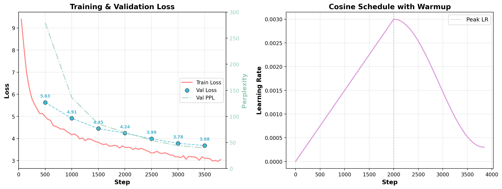

# TinyLM

TinyLM is my attempt at building a small language model from scratch. I want to see how far a ~14M parameter decoder can go using modern transformer architecture, more pretraining, instruction tuning, and eventually RLHF. 

Everything here is written in PyTorch. I didn't use HuggingFace model code, or any pretrained weights.

Current status:  
* ~14.3M parameters
* decoder-only transformer
* pretrained on ~63M tokens from Simple Wikipedia
* continuing pretraining on larger datasets


## Model

```
14,326,016 parameters
622,210,000 tokens seen

12 layers
256 hidden size
4 attention heads
16K BPE vocabulary
1024 context length
```

## Architecture

**14,326,016 parameters** | **12 layers** | **d_model=256** | **4 heads** | **vocab=16,000**

```
Token Embedding (V=16K × d=256)
       ↓
   RoPE (precomputed)
       ↓
  [×12 Transformer Blocks]  ←── each block:
       │                        ├── RMSNorm → Multi-Head Attention (h=4) + RoPE
       │                        └── RMSNorm → SwiGLU FeedForward (d=768)
       ↓
   RMSNorm
       ↓
   LM Head (tied with embeddings)
       ↓
     logits
```

### Key Design Choices

| Component | Detail |
|-----------|--------|
| **Position Encoding** | Rotary Position Embeddings (RoPE), θ=10,000 |
| **Normalization** | Pre-norm RMSNorm (no learnable bias) |
| **Activation** | SwiGLU (gated SiLU) - 3 linear projections per FFN |
| **Weight Tying** | Embedding ↔ LM head weights are shared |
| **Init** | Normal(0, 0.02) with residual scaling `1/√(2N)` |

### Parameter Count

| Component | Params |
|-----------|-------:|
| Token Embedding | 16,000 × 256 = 4,096,000 |
| Attention (12×) | 12 × 4 × 256 × 64 = 3,145,728 |
| FFN (12×) | 12 × 3 × 256 × 768 = 7,077,888 |
| RMSNorm (25×) | 25 × 256 = 6,400 |
| **Total** | **14,326,016** |

## Training

- **Data**: Simple Wikipedia (~63M tokens)
- **Optimizer**: AdamW (β₁=0.9, β₂=0.95, λ=0.1)
- **Schedule**: Linear warmup (2K steps) → cosine decay to 3e-4
- **Peak LR**: 3e-3 | **Batch**: 16 × 1024 tokens
- **Gradient Clipping**: 1.0
- **Mixed Precision**: bfloat16

### Loss Curve



| Step | Train Loss | Train PPL | Val Loss | Val PPL |
|-----:|----------:|----------:|--------:|--------:|
| 500 | 4.99 | 146.3 | 5.63 | 279.5 |
| 1000 | 4.16 | 64.4 | 4.91 | 136.0 |
| 2000 | 3.60 | 36.6 | 4.24 | 69.5 |
| 3000 | 3.18 | 24.0 | 3.78 | 43.9 |
| 3840 | 3.04 | 21.0 | 3.68 | 39.6 |

## Usage

### Download from Hugging Face

```bash
# Download v3 checkpoint (trained on 600M+ tokens)
huggingface-cli download tinylm/tinylm-v3 checkpoints/tinylm-v3.pt --local-dir .
# or via direct link
wget https://huggingface.co/tinylm/tinylm-v3/resolve/main/checkpoints/tinylm-v3.pt -P checkpoints/
```

### Inference

```python
from src.model import TinyLM
from tokenizers import Tokenizer
import torch

model = TinyLM()
model.load_state_dict(torch.load("checkpoints/tinylm-v3.pt", map_location="cpu"))
model.eval()

tokenizer = Tokenizer.from_file("tokenizer/tokenizer.json")

ids = tokenizer.encode("The meaning of life is").ids
idx = torch.tensor([ids])
out = model.generate(idx, max_new_tokens=100, temperature=0.8, top_k=40)
print(tokenizer.decode(out[0].tolist()))
```

### Interactive Generation

```bash
python scripts/interactive_gen.py
```

### Benchmark

```bash
python scripts/benchmark.py
```

### Regenerate Diagrams

```bash
python scripts/arch_diagram.py      # -> assets/architecture.png
python scripts/loss_graph.py        # -> assets/loss_curve.png
```

## Project Structure

```
TinyLM/
├── main.py                    # Training entrypoint
├── src/
│   ├── config.py              # Hyperparameters
│   ├── model.py               # TinyLM model definition
│   ├── train.py               # Training loop
│   ├── data.py                # Dataset & tokenizer pipeline
│   └── inference.py           # Generation demo
├── scripts/
│   ├── download_data.py       # Download Simple Wikipedia
│   ├── arch_diagram.py        # Architecture visualization
│   ├── loss_graph.py          # Training curve plotter
│   ├── benchmark.py           # Throughput benchmark
│   └── interactive_gen.py     # Interactive shell
├── assets/
│   ├── architecture.png       # Architecture diagram
│   └── loss_curve.png         # Training loss plot
├── tokenizer/
│   └── tokenizer.json         # BPE tokenizer
├── checkpoints/
│   ├── ckpt_{step}.pt         # Checkpoints
│   └── tinylm_final.pt        # Final weights
└── data/
    ├── corpus.txt             # Raw text
    ├── train.bin              # Tokenized train
    └── val.bin                # Tokenized validation
```

## License

MIT
